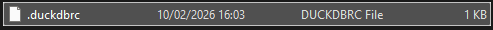

## Windows installation (DuckDB Desktop tooling)

-   You will have a powerful tool in your CMD/PowerShell. No need to run R or Python.
-   We will use `winget`, which is an official Microsoft tool (Windows Package Manager). It is **safe** because it pulls packages from the Microsoft Community Package Manifest Repository. This Microsoft resource has a review process to ensure packages are safe and legitimate.
-   Open a cmd or PowerShell window and run the following command: `winget install DuckDB.cli --version 1.4.4`
-   If you already have another DuckDB version installed, you should uninstall it using this command: `winget uninstall DuckDB.cli`. You may need to reinstall the extensions after upgrading.
-   There is a file, `.duckdbrc`, in this repository. You need to copy it to your user folder (`C:\Users\your_user_name`). This file contains the proxy configuration for DuckDB. If you do not copy this file, you will not be able to install extensions or use the user interface.

-   Then, you can start using DuckDB by running the command in a cmd or PowerShell window: `duckdb`
-   You can use the following command to check your installed extensions: `SELECT extension_name, installed, description FROM duckdb_extensions();`

-   You can exit DuckDB using `.exit` or simply close the window.

### Extensions

-   If you only read CSV files, it is not mandatory to install the other extensions. You can skip these extensions.
-   If you have already executed DuckDB in your terminal/PowerShell, you will not need to do it again.
-   If you cannot install extensions, go back and make sure you copied the `.duckdbrc` file to your user folder (`C:\Users\your_user_name`).

| Extension  | Command                                       | Description                                                           |
|------------|-----------------------------------------------|------------------------|
| Excel      | `INSTALL excel;LOAD excel;`                   | Enables you to read and write Excel (.xlsx) files                     |
| Spatial    | `INSTALL spatial;LOAD spatial;`               | Provides support for geospatial data processing                       |
| SQLite     | `INSTALL sqlite_scanner;LOAD sqlite_scanner;` | Allows DuckDB to read and write data from SQLite database files      |
| Httpfs     | `INSTALL httpfs;LOAD httpfs;`                 | Allows you to read and write remote files over HTTP(S) and S3        |
| UI         | `INSTALL ui;LOAD ui;`                         | Enables the web-based user interface                                  |

### How to use DuckDB

-   If you have already executed DuckDB in your terminal/PowerShell, you won't need to do it again.
-   There is a folder called **data** in this repository. You can use the files in this folder to practise with DuckDB.
-   If you want to read files from your network and you do not want to deal with long absolute or relative paths, you can use this Windows workaround. Open File Explorer, go to your network folder, hold Shift, and right-click in an empty area. You will see **Open PowerShell window here**. 

-   You can write SQL in multiple lines. Press Enter for multiple lines. A colon (`;`) marks the end of a query.
