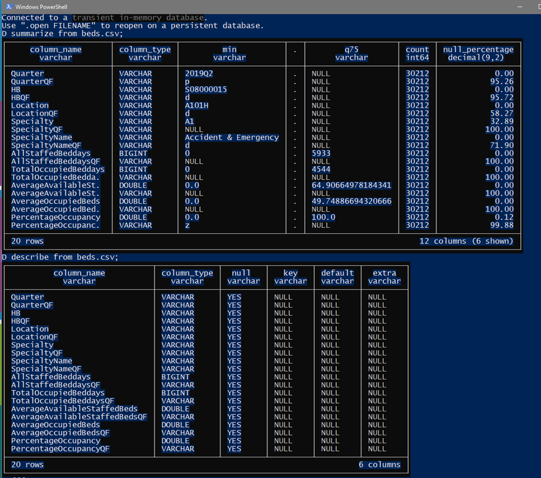
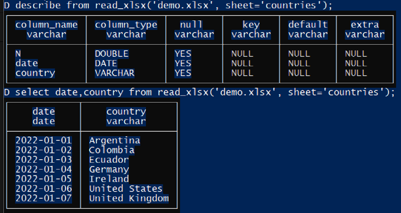
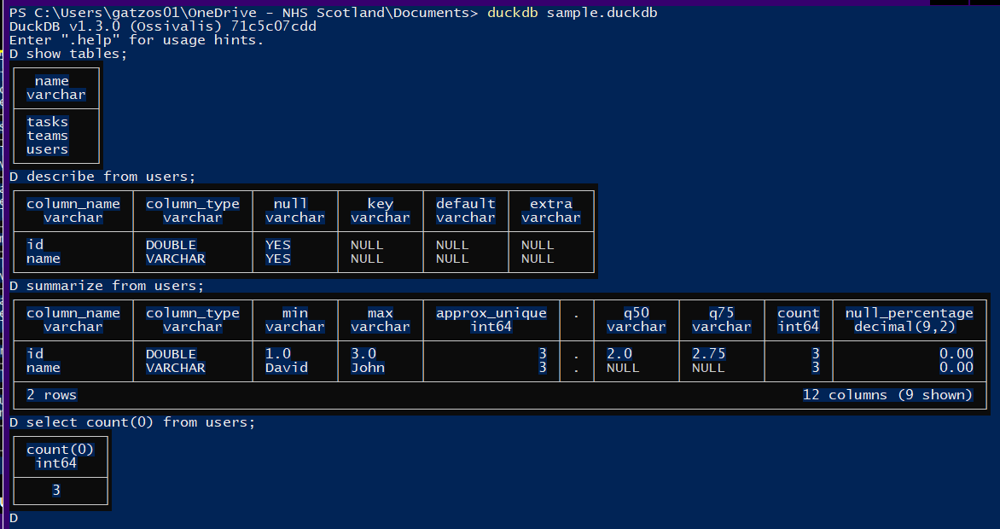
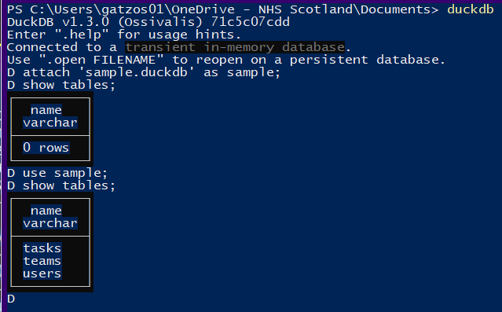
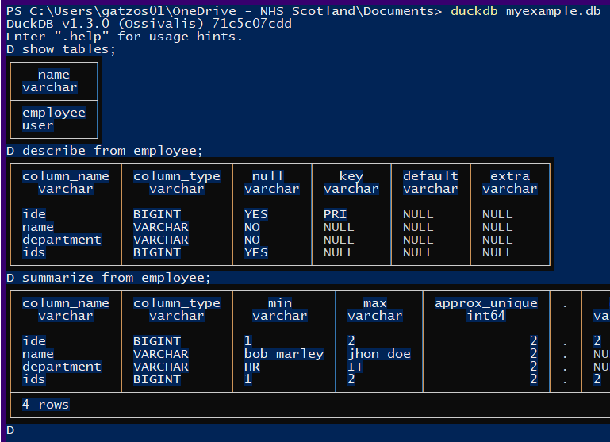
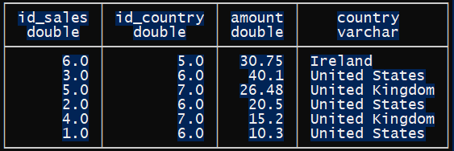
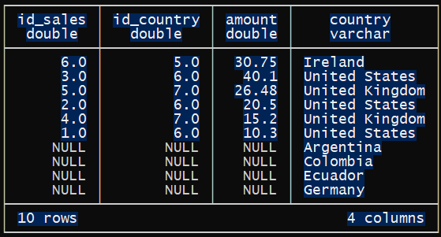
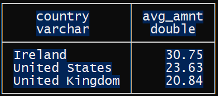

## Common queries
These example queries can be run in the terminal (OS tool), the web user interface (OS tool extension), or as part of an R or Python script. The project includes a data folder containing common file types that you can use to practise your queries.

### Initial SQL commands
The images below show the results obtained from running the queries in the Windows terminal.

-   There are two very useful commands for checking datasets: “describe” and “summarize”. In this example, I am using beds.csv: `describe from file_name.csv` or `summarize from file_name.csv`.



-   It’s time to read an excel file using the function read_xlsx('file_name.xlsx', sheet='sheet_name')



-   If you have a parquet file, it is simple as a csv file

-   If you have a DuckDB.file you can easily start duckdb with the name of the file.



-   If you already started duckdb with no duck file. You can run "attach" and "use" commands



-   It is the same process if you want to work with a sqlite file:



-   If you want to export one table from a duckdb or sqlite database, you can use the command COPY `COPY table_name to ‘file_name.csv’ (format ‘csv’);` `COPY table_name to ‘file_name.parquet’ (format ‘parquet’);` `COPY (select field_name, mean(value) as mean_value from admissions_day group by field_name) to ‘grouped_field_mean.csv’ (format ‘csv’);`

### Intermediate SQL commands

-   You can join 2 tables (same file or different files and formats)

```         
select a.*, b.country
from read_xlsx('demo.xlsx', sheet='sales') a left join read_xlsx('demo.xlsx', sheet='countries') b
on a.id_country=b.id;
```



```         
select a.*, b.country
from read_xlsx('demo.xlsx', sheet='sales') a full join read_xlsx('demo.xlsx', sheet='countries') b
on a.id_country=b.id;
```



-   You can have multiple subqueries like this:

```         
WITH cleaned AS (
  SELECT * FROM read_xlsx('demo.xlsx', sheet='sales')
  WHERE amount IS NOT NULL
),
aggregated AS (
  SELECT id_country, AVG(amount) as avg_amount
  FROM cleaned
  GROUP BY id_country
)
select b.country, round(a.avg_amount, 2) as avg_amnt
from aggregated a join read_xlsx('demo.xlsx', sheet='countries') b
on a.id_country=b.id
order by avg_amount desc;
```



### Advanced SQL commands

-   Regular expressions for column names using columns function `select HB, columns('Average.*') from beds.csv;`
-   We can create the pivot of a table `PIVOT beds.csv ON Quarter USING MEAN(PercentageOccupancy) GROUP BY HB;`
-   It is possible to do the unpivot too `UNPIVOT pivoted.csv ON COLUMNS(* EXCLUDE HB) INTO NAME Quarter VALUE sales;`
