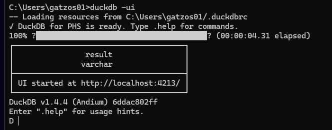
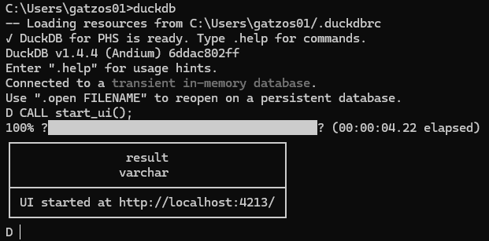
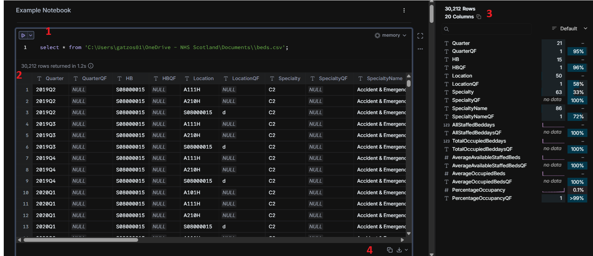
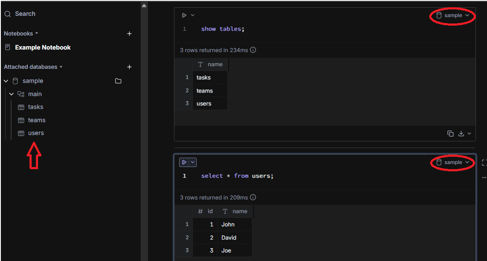
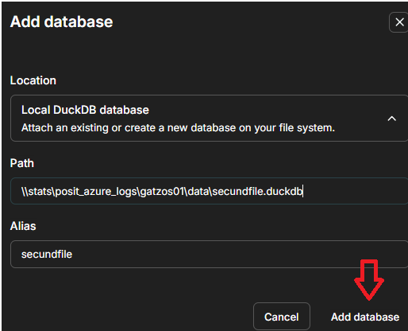
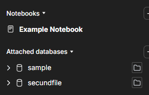

# DuckDB user interface

This directory contains the user interface components for DuckDB, a high-performance database management system. The UI is designed to provide an intuitive and user-friendly experience for interacting with DuckDB databases.

# Pre requirements

-   You need to install DuckDB. Please, follow the instructions in the main README.md file.
-   Make sure you have copied the file .duckdbrc in your user folder (C:\Users\your_user_name). This file contains the proxy configuration for duckdb. If you don't copy this file, you won't be able to install extensions and use the user interface.
-   You need to install ui extension if you want to use the UI functionalities.

```         
INSTALL ui;LOAD ui;
```

-   You have 2 options to open the user interface:

| Method           | Pre command      | Command            | Description                                                                     |
|------------------|------------------|--------------------|---------------------------------------------------------------------------------|
| DuckDB CLI       | No pre command   | `duckdb -ui`       | Open a CMD/PowerShell and execute this command                                  |
| Function command | `duckdb`         | `CALL start_ui();` | Open a CMD/PowerShell, run pre command `duckdb` and then run `CALL start_ui();` |

-   You will see this result in your PowerShell/terminal:

DuckDB CLI Method:


Method 2:


-   This command will open a new tab in your default web browser. You can start using DuckDB UI. You will see a blank SQL Notebook.

## How to read a csv file
You can run the following command in a cell. You can press the play button on the left of the cell or press ctrl + enter to execute the cell. Make sure to change the path to your csv file:

```
select * from 'C:\Users\<Your_user>\OneDrive - NHS Scotland\Documents\\beds.csv';
```

The image bellow contains section 1 which shows us the cell content, section 2 which shows us the result of the query, section 3 which shows us some quick options like download and section 4 which shows us some statistics about the query result.



Since you are using DuckDB on Windows you need to use double backslashes (\\) in the path.

## Read a duckdb file
There are 2 ways to read a duckdb file in the UI. If you open a duckdb file in the UI **other users won't be able to read the file**.

1. The quickest way is to run a terminal from the duckdb file folder. Open a terminal in the folder where your duckdb file is located and run the command `duckdb sample.duckdb -ui`. You are linking your terminal to the duckdb file. 

In this case if you create an empty cell you will see the word sample (duckdb file name) on the right of the cell. If you see memory it means this cell is not linked to the duckdb file. You will also see a bar on the left hand side - Attached databases - with all the tables in the duckdb file.



2. The second way occurs when you already opened the user interface with no duckdb file attached. You have to use the left hand bar - **attached databases** secion - to link a duckdb file. You can click on the + icon and then type the duckdb file path (e.g. \\stats\posit_azure_logs\gatzos01\data\secundfile.duckdb). You can also type an alias for the duckdb file. Once you have linked the duckdb file you will be able to see all the tables in the duckdb file in the UI.



You can have more than one duckdb file linked to the UI. 



You can also detach files using the 3 dots on the right of the duckdb file name in the attached databases section.
